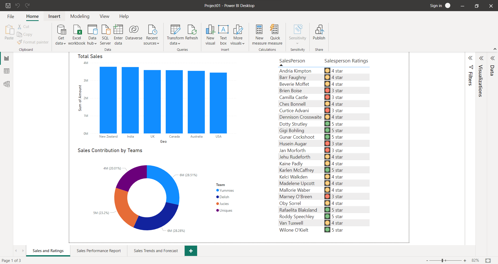
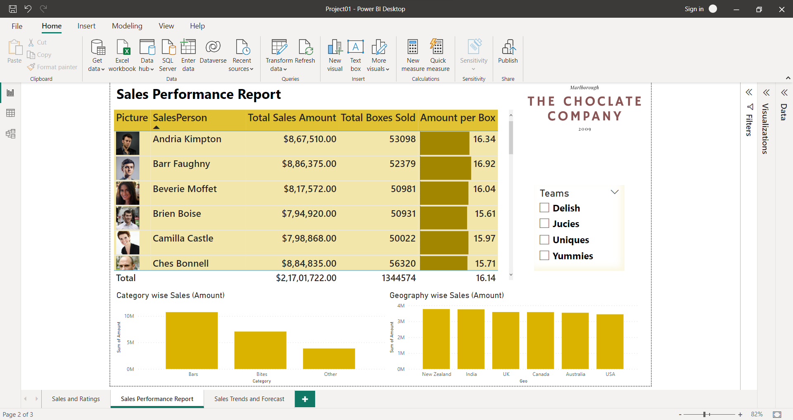
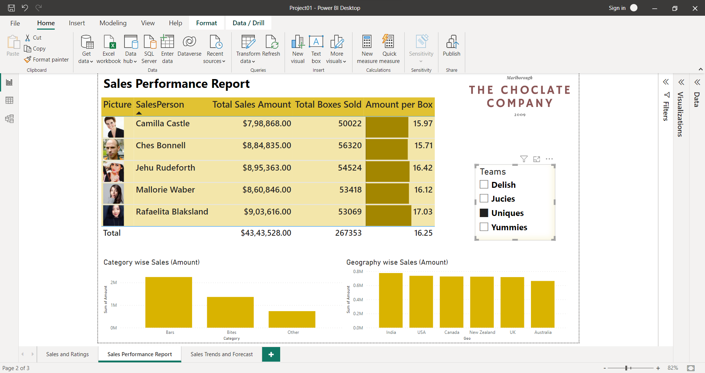
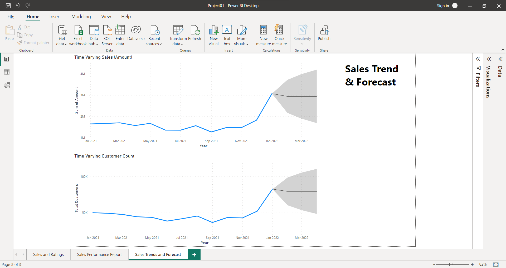

# [Data_Visualisation_using_PowerBi_Portfolio(click here for repo)](https://github.com/Vibhor2256/Data-Visualisation-using-PowerBi-Tableau)

This repository/portfolio is for an End to end data visualization project.   The situation in the project is that there is a chocholate company which has shared its data
about its sale of different category chocholate products. The dataset includes information about "locations of business done", "details of the sales team", "products with 
specifications" and finally "all the details about the sale of the products".    My task was to draw various insights from this dataset which can prove to be helpful for the
business in analysing and decision making. The task consists 'loading and cleaning-up data', 'building a data model', 'Using DAX & Power Pivot to build measures and 
calculations', 'Creating and changing visuals ', 'Answering some of the business questions', 'Understanding past trends & creating forecast', 'Customizing visuals & 
interaction effects' and finally 'Creating a comprehensive sales performance report'.    Below are some static snapshots of the final created POWER BI report pages :-  
* On the left side of the below picture, the graph showcases the Total Sales as per the different geographical areas. 
* Down to it, we can see and draw insights for the questions like 'Which team has the highest total sales contribution?', 'Which sales person has the highesr sales contribution?', etc.
* On the right side of the below picture, the visuals showcases sales persons' ratings as per their sales contribution   
 
  
* Below is the overall sales performance report, it can answer questions like 'Team wise total sales amount', 'total choclate boxes sold', 'Seeing each sales person for their sales details', etc.:   
 
 
  
* Below is the general forecast line for the upcoming 3 months as per the the previous years sales performance:   

   Below is the **video** showcasing **interactive features** of the report :-

https://user-images.githubusercontent.com/61342727/220541178-7067d77f-c890-4d67-8a92-cd0f01b5a8d3.mp4

[Click here](https://user-images.githubusercontent.com/61342727/220541178-7067d77f-c890-4d67-8a92-cd0f01b5a8d3.mp4)
  
### Challenges faced during the report creation :-
* Here is the link for proper documented challenges- [Challenges](Power Bi/Proj01/Notes while making first project.docx) 
